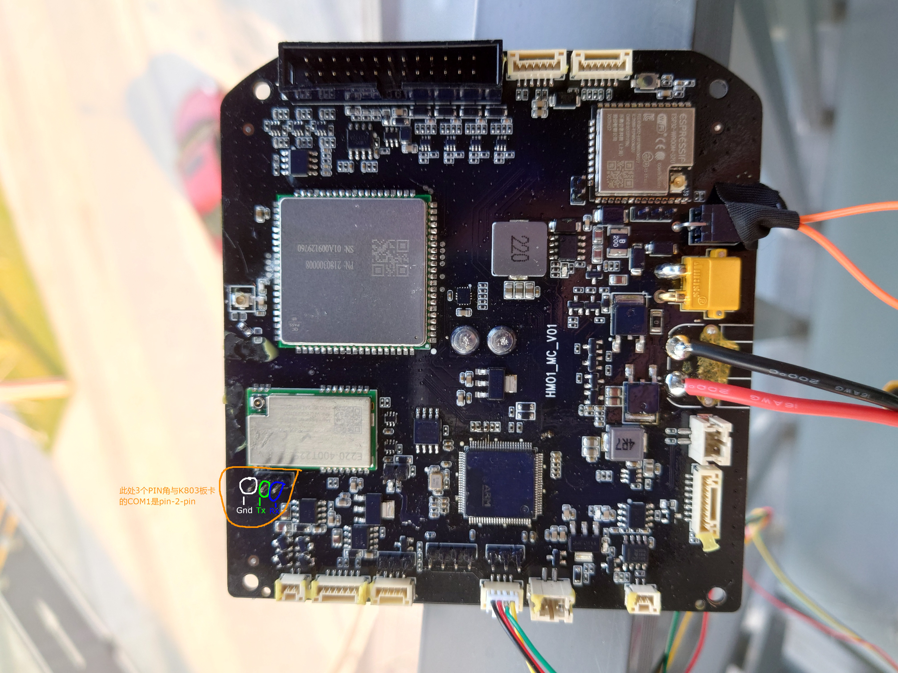
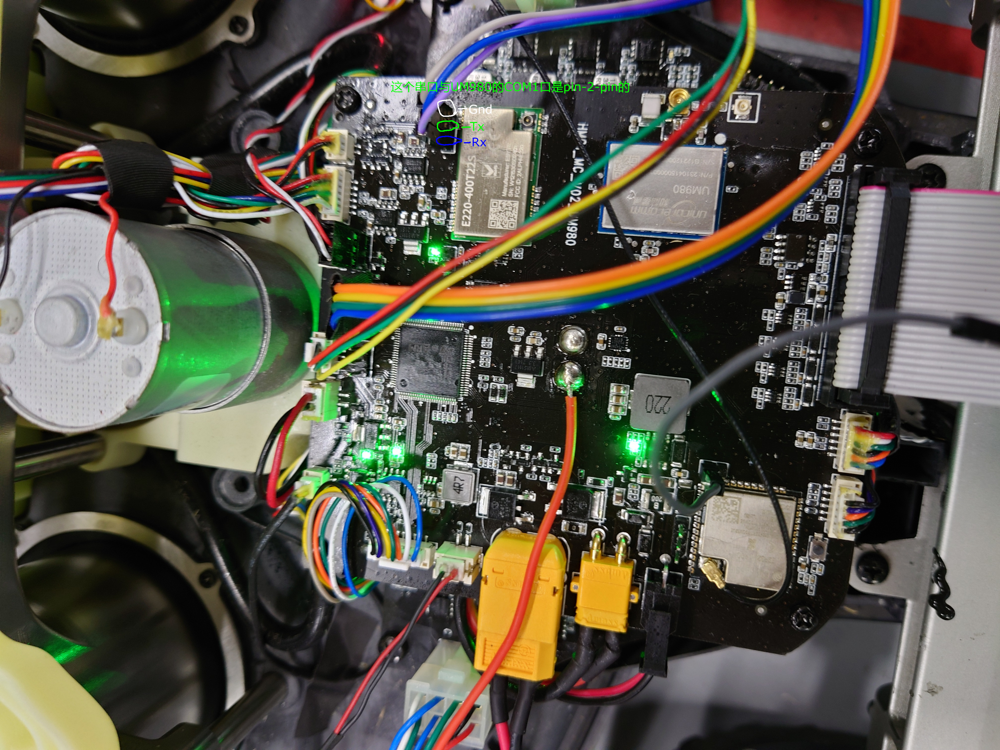

# 1. 基站

## 关于基站/数传的覆盖范围

基站common sense:

20211101@和芯星通@王清松：开阔环境下，单基站的覆盖范围在20KM左右。遮挡就不好说，要看能够共视到多少卫星。

数传common sense:

传输距离一般指的是电台做基准站的传输距离，传输距离要看电台基准站功率和环境是否有遮挡，功率和环境遮挡共同决定范围。

20211101@和芯星通@王清松：和芯星通用的华信的数传（型号：HX-DU1601D）无遮挡应该是5KM，有遮挡就不好说了。

20211101@北斗星通@王工：1瓦特功率覆盖1公里左右。

20211101@华信天线销售：
```
    a. 可视环境下（海面或者空中，可以看到的情况），电台的传输距离可以5-10公里;
    b. 空旷环境下（平原，遮挡较少，有些树林啥的），传输距离3-5公里;
    c. 如果高楼遮挡严重，可能1公里左右。
```

# 2. 移动站

## 单天线 VS 双天线

单天线没法解决航向的问题，双天线才可以做定向。

@20220511:
    割草机的定位模块，必须依赖 imu(icm42688) 和 rtk，有一个坏了，定位就挂了。


images/HMO1/.jpg

## 家用割草机 K803

关于硬件连接如下，




## 家用割草机 UM980

- 要求输出 AGRIC语句 和 PSRVEL语句，均以Binary输出，均是20Hz

```shell
- agricb com1 0.05
- log psrvelb ontime 0.05
```

关于硬件连接如下，




# 3. rtk status

## 3.1 BESTPOS中的 pos type 如何对齐到 GPGGA 中的qual

选取数据，UM4B0_rtkmode_baseantenna-GPS1000_roverantenna-AK613_河边_20211208.log

解析 BESTPOS，

pos type | 个数
-----|-----
NARROW_INT (50)  |  12044
WIDE_INT (49)  |  1315
L1_INT (48)  |  45
NARROW_FLOAT (34)  |  166
L1_FLOAT (32)  |  6
PSRDIFF (17)  |  25
Total  |  13601

解析 GPGGA，
qual | 个数
-----|-----
RTK固定解 (4)  |  12090
RTK浮点解 (5)  |  1487
PSRDIFF (2)  |  25
SINGLE (1)  |  0
Total  |  13602

选取数据，UM982_baseantenna1000_roverantenna-AK613_rtkmode_河边.log

解析 BESTPOS，

pos type | 个数
-----|-----
NARROW_INT (50)  |  5019
WIDE_INT (49)  |  145
L1_INT (48)  |  49
NARROW_FLOAT (34)  |  0
L1_FLOAT (32)  |  0
PSRDIFF (17)  |  1
Total  |  5214

解析 GNGGA，
qual | 个数 | 一半个数
-----|-----|-----
RTK固定解 (4)  |  10136  |  5068
RTK浮点解 (5)  |  290  |  145
PSRDIFF (2)  |  2  |  1
Total  |  10428  | 5214

通过上面两份具体数据，可确认以下对应关系，

NARROW_INT + L1_INT，最后会被认为是 RTK固定解。  12089 -> 12090

NARROW_FLOAT + WIDE_INT + L1_FLOAT，会被认为是 RTK浮点解。  1487 -> 1487


# 4 rtk相关的工具

## 4.1 rtkplot

- 1. rtkplot解析的是 GPGGA 或者是 GNGGA 语句，而不是BESTPOS语句

# 4. 环境对rtk数据的影响

## 4.1 打雷下雨，对gps 单点数据有影响吗？

20220222@和芯星通@王青松：下下雨，不打雷，这个影响不是太大

20220222@和芯星通@王青松：打雷是有影响的


# N. 关于rtk 好的文章推荐

GNSS基准站网数据处理方法与应用

https://books.google.ca/books?id=H-kLEAAAQBAJ&pg=PT191&lpg=PT191&dq=rtk%E9%87%8C%E9%9D%A2%E7%9A%84%E6%A8%A1%E7%B3%8A%E5%BA%A6&source=bl&ots=aYw8xnKKcF&sig=ACfU3U2-JRa4hHfC0ZSd6z6nLrGGRYWCsg&hl=en&sa=X&ved=2ahUKEwikr6DdsO32AhVHVs0KHbb8BK4Q6AF6BAgQEAM#v=onepage&q=rtk%E9%87%8C%E9%9D%A2%E7%9A%84%E6%A8%A1%E7%B3%8A%E5%BA%A6&f=false
