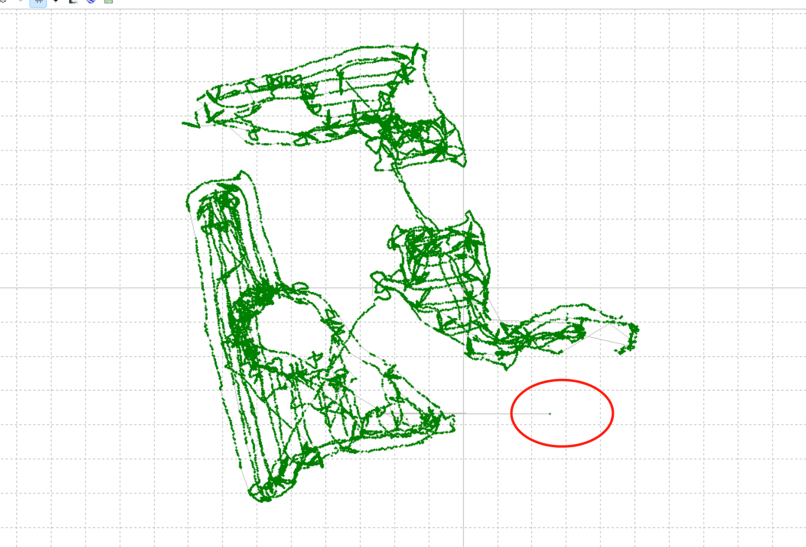
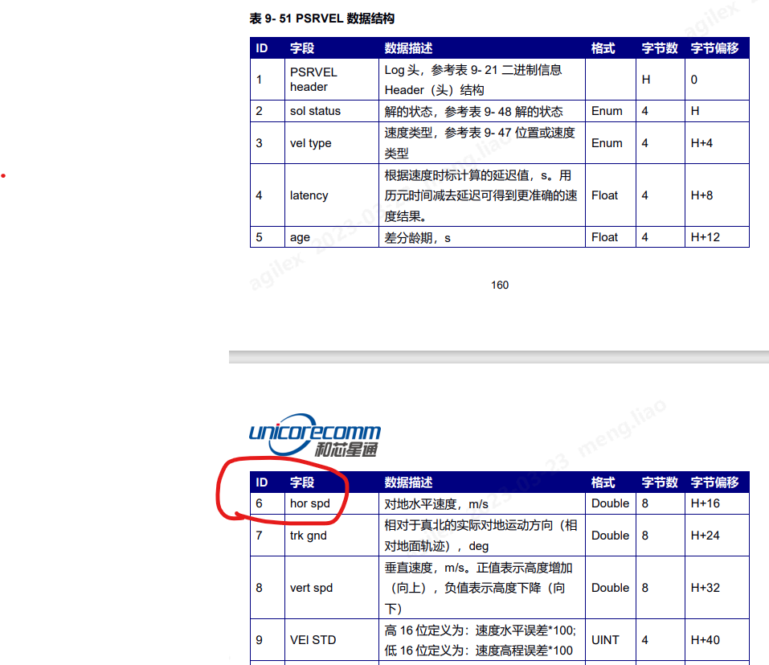
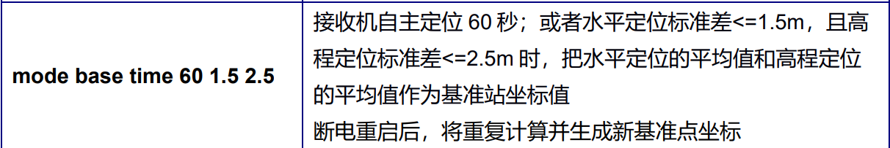

# 0. 定位算法



20230203@王宁，1个飞点无所谓。

20230323@王宁，固定解的情况下，融合定位也会使用imu数据。



伪距速度输出的 hor spd（即水平方向的多普勒速度），只有0和正值，没有负值，它代表的是一个模值。

## 0.1 画边界的逻辑

20230306@王宁：
    开始画边界时，必须是固定解。如果在画边界过程中，丢失固定解了，会靠IMU + 轮速里程计续命，每续命1m，会通过App给用户提示，是“继续（即忽略）”还是“退出”，如用户选择“继续”，则继续续命，若rtk仍未恢复固定解了，则继续直至画完边界，若rtk恢复固定解了，则使用rtk位置。


# 1. 基站

## 关于基站/数传的覆盖范围

基站common sense:

20211101@和芯星通@王清松：开阔环境下，单基站的覆盖范围在20KM左右。遮挡就不好说，要看能够共视到多少卫星。

数传common sense:

传输距离一般指的是电台做基准站的传输距离，传输距离要看电台基准站功率和环境是否有遮挡，功率和环境遮挡共同决定范围。

20211101@和芯星通@王清松：和芯星通用的华信的数传（型号：HX-DU1601D）无遮挡应该是5KM，有遮挡就不好说了。

20211101@北斗星通@王工：1瓦特功率覆盖1公里左右。

20211101@华信天线销售：
```
    a. 可视环境下（海面或者空中，可以看到的情况），电台的传输距离可以5-10公里;
    b. 空旷环境下（平原，遮挡较少，有些树林啥的），传输距离3-5公里;
    c. 如果高楼遮挡严重，可能1公里左右。
```

### 基站在什么情况下会发出差分数据

以下语句可用于设置基站的收敛条件：



60秒一到，即便基站还没有进入固定解，也会发出差分数据吗？

王青松@20220531：即便60秒到了，如果没有固定解是没有差分数据输出的，只有固定后才有差分输出。


# 2. 移动站

## 单天线 VS 双天线

单天线没法解决航向的问题，双天线才可以做定向。

@20220511:
    割草机的定位模块，必须依赖 imu(icm42688) 和 rtk，有一个坏了，定位就挂了。


## 家用割草机 K803

关于硬件连接如下，


## 家用割草机 UM980


- 要求输出 AGRIC语句 和 PSRVEL语句，均以Binary输出，均是20Hz

```shell
- agricb com1 0.05
- log psrvelb ontime 0.05
```

关于硬件连接如下，


# 3. rtk status

## 3.1 BESTPOS中的 pos type 如何对齐到 GPGGA 中的qual

选取数据，UM4B0_rtkmode_baseantenna-GPS1000_roverantenna-AK613_河边_20211208.log

解析 BESTPOS，

pos type | 个数
-----|-----
NARROW_INT (50)  |  12044
WIDE_INT (49)  |  1315
L1_INT (48)  |  45
NARROW_FLOAT (34)  |  166
L1_FLOAT (32)  |  6
PSRDIFF (17)  |  25
Total  |  13601

解析 GPGGA，
qual | 个数
-----|-----
RTK固定解 (4)  |  12090
RTK浮点解 (5)  |  1487
PSRDIFF (2)  |  25
SINGLE (1)  |  0
Total  |  13602

选取数据，UM982_baseantenna1000_roverantenna-AK613_rtkmode_河边.log

解析 BESTPOS，

pos type | 个数
-----|-----
NARROW_INT (50)  |  5019
WIDE_INT (49)  |  145
L1_INT (48)  |  49
NARROW_FLOAT (34)  |  0
L1_FLOAT (32)  |  0
PSRDIFF (17)  |  1
Total  |  5214

解析 GNGGA，
qual | 个数 | 一半个数
-----|-----|-----
RTK固定解 (4)  |  10136  |  5068
RTK浮点解 (5)  |  290  |  145
PSRDIFF (2)  |  2  |  1
Total  |  10428  | 5214

通过上面两份具体数据，可确认以下对应关系，

NARROW_INT + L1_INT，最后会被认为是 RTK固定解。  12089 -> 12090

王青松@20220817：L1_INT（单频固定解）的绝对误差在 5cm；

L1_INT 指的是单频点解算出的固定解，这里的单频点可能是L1频点，也可能是L2频点，还可能是L5频点。

NARROW_FLOAT + WIDE_INT + L1_FLOAT，会被认为是 RTK浮点解。  1487 -> 1487

王青松@20220817：WIDE_INT（宽巷固定解）的绝对误差在 30cm；


王青松@20220817：

现在定位精度有2个量级，5cm误差，和 30cm误差。我判断 5cm误差指的是固定解算（也就是NARROW_INT 或者 L1_INT）的精度，而 30cm误差指的是浮点解（可能是NARROW_FLOAT，WIDE_INT，或者L1_FLOAT）的精度。

王青松@20220817：

1. 我们不推荐客户使用 rtk浮点解；
2. rtk浮点解的时候，可以参考 PsrPos的定位结果。


# 4 rtk相关的工具

## 4.1 rtkplot

- 1. rtkplot解析的是 GPGGA 或者是 GNGGA 语句，而不是BESTPOS语句

关于GGA语句，rtkplot显示的高程信息是：

alt（GGA语句的字段10） - undulation（GGA语句的字段12）

## 4.2 Unicore Converter

以下讨论基于 v3.0.7-2022-5-12

1. 需基于ASC格式，而非Binary格式文件，生成 Renix Obs data

## 4.3

## 4.4

## 4.5

## 4.9 GPS Tool
王青松@20230201，

当使用GPS Tool，计算两个GGA点（LLA）之间的距离时，如果要计算准确的3D距离，那么，高程应该使用"alt（GGA语句的字段10） - undulation（GGA语句的字段12）"。


# 5 rtk数据分析

## 5.1 采集了一份包含原始观测值的数据后，如何分析


# 6. 环境对rtk数据的影响

## 6.1 打雷下雨，对gps 单点数据有影响吗？

20220222@和芯星通@王青松：下下雨，不打雷，这个影响不是太大

20220222@和芯星通@王青松：打雷是有影响的


# 7. rtk算法

20230203@王青松：

rtk位置解算是实时解算的，并不是基于滤波（也就是基于上一帧的状态加上当前帧的观测，推算出当前帧的状态）的方法，纯粹是根据当前的卫星观测解算出来的，比滤波算法更快，以保证实时性。打个比方，第 1-19 帧均是固定解，第 20 - 49帧退出固定解（包含浮点和伪距），第50帧恢复固定解。那么，第49帧到第50帧的跳变距离，并不代表累计误差，只是代表两个点之间的距离。因为第49帧与第48帧间，没什么关联，都是实时解算的，第49帧不是基于第48帧推导出来的。


# N. 关于rtk 好的文章推荐

GNSS基准站网数据处理方法与应用

https://books.google.ca/books?id=H-kLEAAAQBAJ&pg=PT191&lpg=PT191&dq=rtk%E9%87%8C%E9%9D%A2%E7%9A%84%E6%A8%A1%E7%B3%8A%E5%BA%A6&source=bl&ots=aYw8xnKKcF&sig=ACfU3U2-JRa4hHfC0ZSd6z6nLrGGRYWCsg&hl=en&sa=X&ved=2ahUKEwikr6DdsO32AhVHVs0KHbb8BK4Q6AF6BAgQEAM#v=onepage&q=rtk%E9%87%8C%E9%9D%A2%E7%9A%84%E6%A8%A1%E7%B3%8A%E5%BA%A6&f=false
