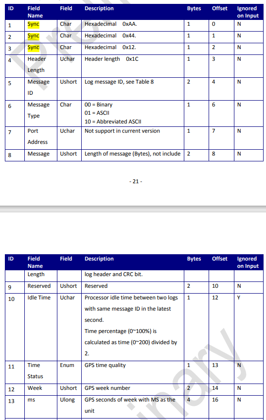
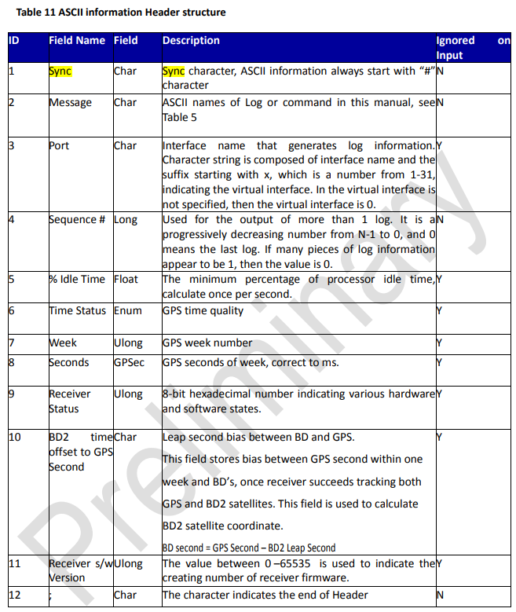
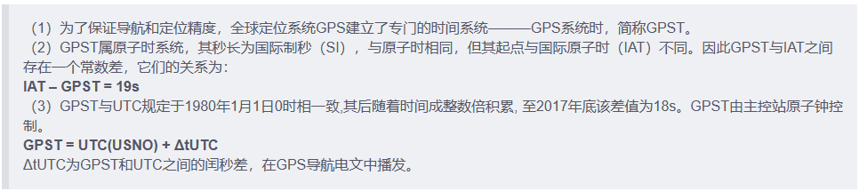
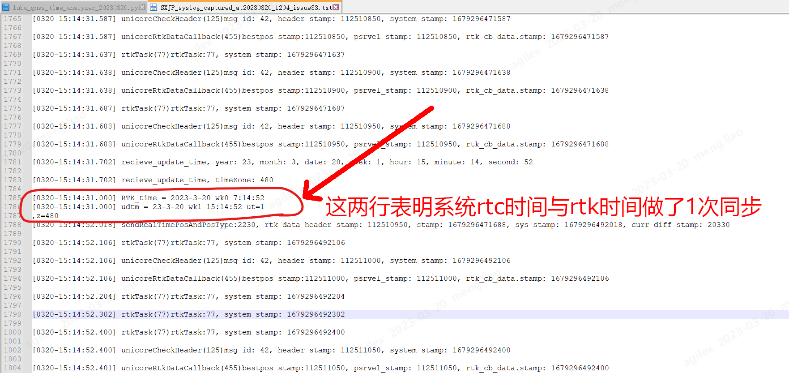

## GPST 和 UTC之间的闰秒差

先从实际例子着手，2023-03-17 我在智园楼顶，抓取到了下面的系统日志，

[0317-17:27:35.381] unicoreRtkDataCallback(449)bestpos stamp:466072500, psrvel_stamp: 466072500, rtk_cb_data.stamp: 1679045255381

1679045255381 -> Fri Mar 17 17:27:35.381     2023

466072.5sec -> 17:27:52.500

在当前下午 14:44:28采集的数据中，看到“闰秒时间”是18秒。

如上表，header里面的“week/周”，以及“Seconds/周内秒”，指的是GPS时间。

在“https://blog.csdn.net/weixin_42536748/article/details/124040756”文章里，有如下的描述，

根据第（3）点， Fri 2023 Mar 17 17:27:52.500（GPST）对应的 UTC 为 Fri 2023 Mar 17 17:27:34.500（UTC）

系统日志里的 utc时间：0317-17:27:35.381
根据GPST计算的 utc时间：0317-17:27:34.500，相差了881msec。

1 开机时时间同步

上图中的 wk0指的是 week0。

故事是这样的，

开机  ->  对rtk进行初始化  ->  rtk初始化完成，直至获取到rtk时间  ->  系统时间 0320-15:14:31.000 看到 RTK时间是 2023-3-20 wk0 7:14:52  ->  做1次时间同步  ->  下一行log 系统时间更新为 “0320-15:14:52.018”。