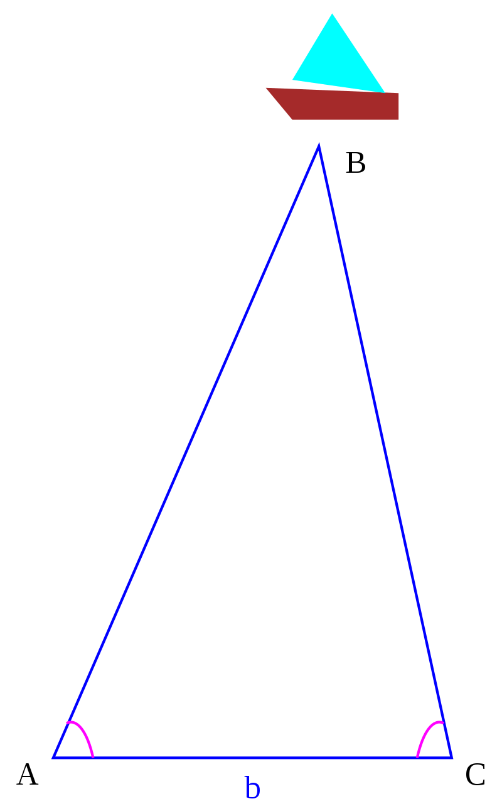
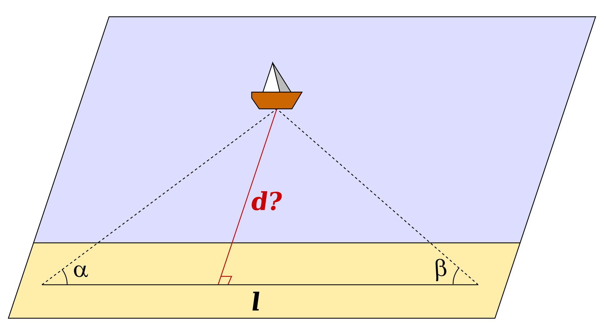

## 三角测量法（Triangulation） 和 三边测量法（Trilateration） 分别是什么？

### 三角测量法（Triangulation）

首先，需要有个三角形。

要找到图中目标点B的位置，前提：
- 已知点A
- 已知点C
- AC之间的基线长度b
- AB 与 AC之间的夹角，CB 与 CA之间的夹角

如上图，三角测量可以计算船只与岸边之间的距离。

- A顶点的观测者测量岸边与船只之间的角度为 a，B顶点的观测者测量岸边与船只之间的角度为 b，
- A与B之间的距离为l

l = d / tan(a) + d / tan(b)

因tan(a) = sin(a) / cos(a)，所以1/tan(a) = cos(a)/sin(a)

l = d*[cos(a)/sin(a) + cos(b)/sin(b)] = d*[cos(a)*sin(b) + sin(a)*cos(b)]/[sin(a)sin(b)]

因 sin(a+b) = sin(a)*cos(b) + cos(a)*sin(b)

所以 l = d*sin(a+b)/[sin(a)sin(b)]，也就是 d = l * [sin(a)*sin(b)] / sin(a+b)