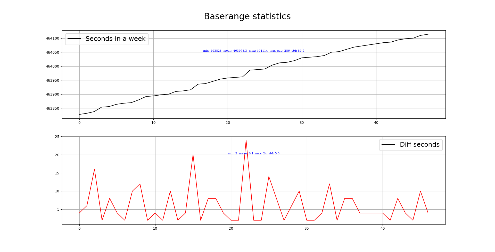

## Baserange语句

和芯王青松@20230506：
    baserange的 "Trigger Type"只能是 ONCHANGED

- 
数据采集方法：尾部 usb桥接

数据采集时间段：2023-04-28  16:50:10（CST） - 2023-04-28  16:54:56（CST），智园楼顶，

时长：5分钟

baserange帧数：48



相邻两帧baserange间隔：
```
    最小间隔2秒
    最大间隔24秒
    平均间隔6.1秒
```