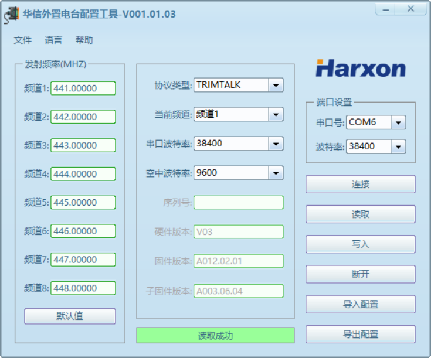
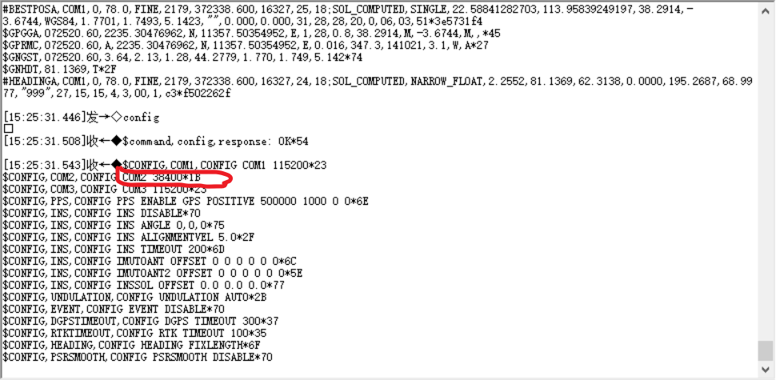

## 问题记录

### 移动站端数传有数据输出，但是移动站pose始终是single，而heading是NARROW_INT

#### Step1: 检查数传模块的波特率

打开新版的电台配置软件，电台开机3秒后点击“连接”按钮，电台连接成功后，点击“读取”按钮，可以读取到所有配置信息，如下，



从上图得知，电台的“串口波特率”为38400。

#### Step2: 确认基站，移动站接数传的串口的波特率设置为了38400

基站的 rtcm信号是通过com2输出给数传模块的，移动站端数传模块是通过com2输出给接收机的，

首先，可以通过如下命令分别配置基站，移动站的com2的波特率为 38400，

```shell
config com2 38400
```

在串口调试助手输入config，可以查看到各com口的波特率信息，如下，



如上图所示，在移动站端输入config命令后，可以确认com2的波特率为38400。

#### Step3: 确认基站数传模块发出的 和 移动站数传模块接收到的数据是以 "D3 00"开头的

首先，不论是移动站还是基站，在串口调试助手中输入 "unlogall" 可以关闭掉所有已打开的log输出。

在基站端，用串口调试助手连接com2口，选择38400波特率，直接查看输出，应该可以看下以 "D3 00"开头的消息，如下，


