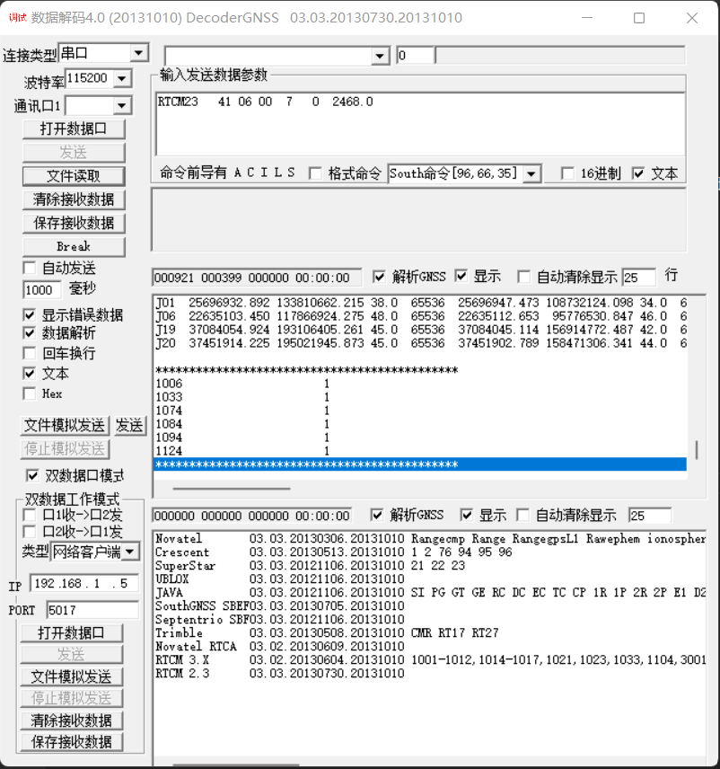

## 1. 基站端发出的差分电文

差分电文  |  Description
----|----
RTCM1005  |  RTK基站坐标（实际是天线坐标）（ARP）
RTCM1006  |  RTK基站坐标（实际是天线坐标）（含天线高），天线高指的是基站天线相对于地面标识点的高度，我理解，参考点坐标指的是平面偏移信息，HEN分别对应 Height / East / North.
RTCM1033  |  接收机和天线说明，天线的ID、名称、型号和相位中心偏差信息


一包完整的差分电文的定义是：

```
1帧RTCM1006 + 1帧RTCM1033 + 1帧RTCM1074 + 1帧RTCM1084 + 1帧RTCM1094 + 1帧RTCM1124
```

**问题1**： 980一包完整的差分数据有多少个Bytes？

测试1： 921Bytes，此包经过电台传输，接收端收到了610Bytes，已通过"DecoderGnss"验证过是一包完整的差分数据。


