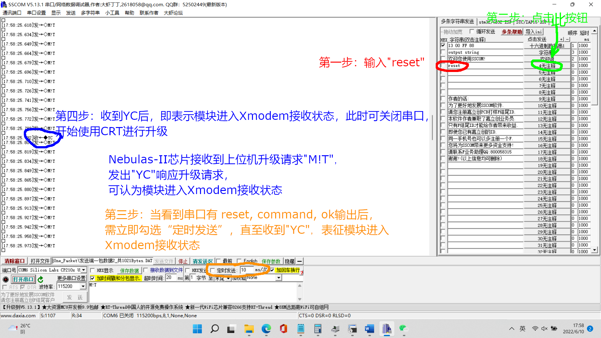
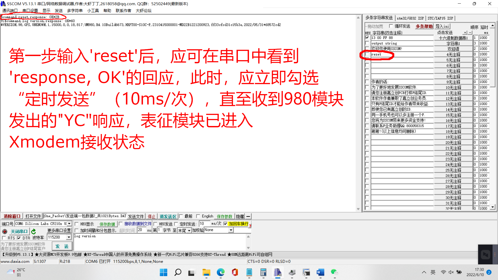
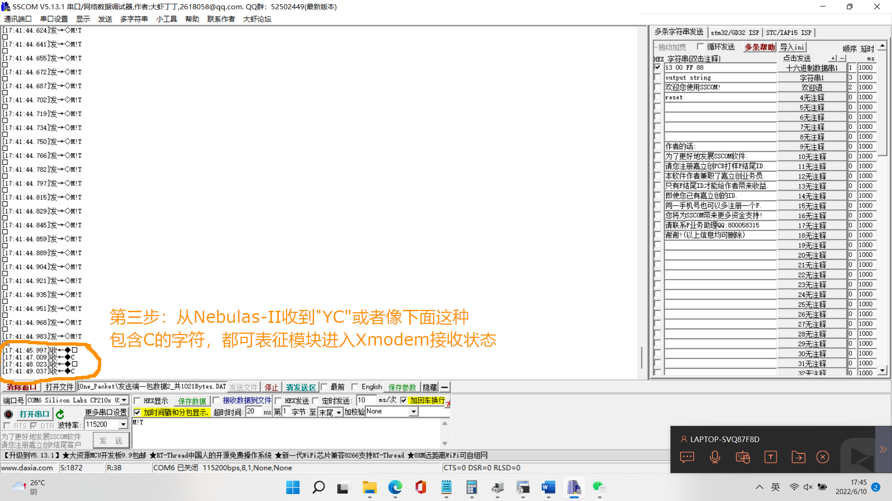
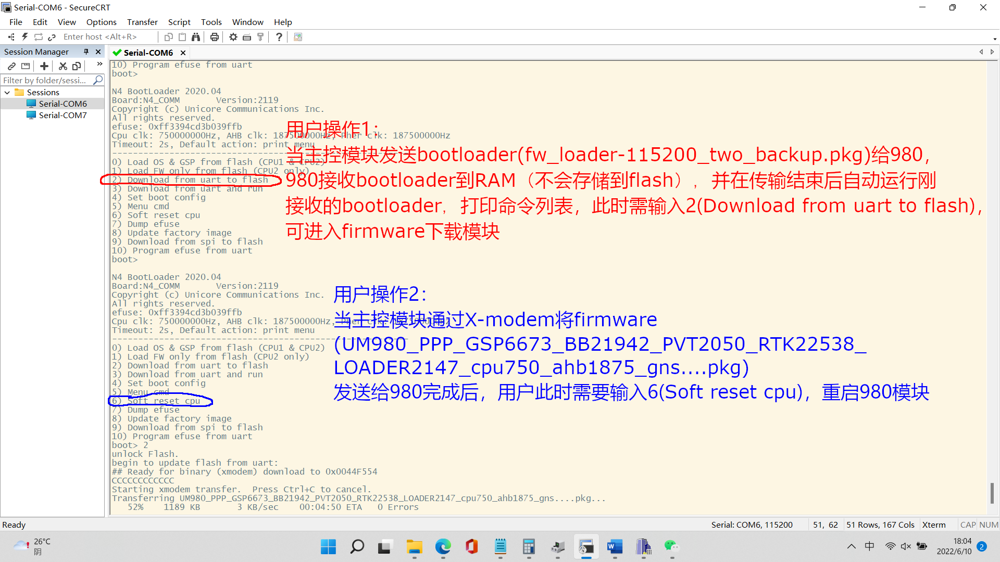
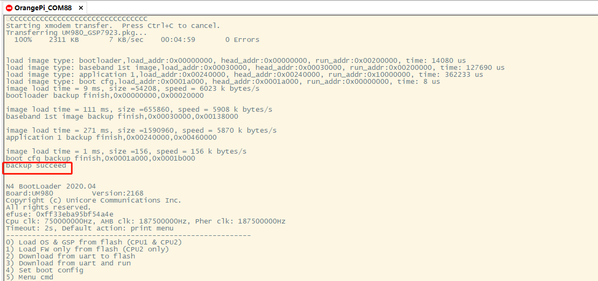

## 1. 基站端发出的差分电文

差分电文  |  Description
----|----
RTCM1005  |  RTK基站坐标（实际是天线坐标）（ARP）
RTCM1006  |  RTK基站坐标（实际是天线坐标）（含天线高），天线高指的是基站天线相对于地面标识点的高度，我理解，参考点坐标指的是平面偏移信息，HEN分别对应 Height / East / North.
RTCM1033  |  接收机和天线说明，天线的ID、名称、型号和相位中心偏差信息


一包完整的差分电文的定义是：

```
1帧RTCM1006 + 1帧RTCM1033 + 1帧RTCM1074 + 1帧RTCM1084 + 1帧RTCM1094 + 1帧RTCM1124
```

**问题1**： 980一包完整的差分数据有多少个Bytes？

测试1： 921Bytes，此包经过电台传输，接收端收到了610Bytes，已通过"DecoderGnss"验证过是一包完整的差分数据。


## 3. 固件升级

### 3.1 使用 sscom + SecureCRT 方式

使用 sscom部分，

如果980接收到了升级请求（具体就是多个连续的"M!T"或者0x08字符），会发出"YC"响应升级请求，并进入X-Modem接收状态，







使用 CRT部分，






上面是7361升级7923时的打印。

```
bootloader区：
    0x00000000 - 0x00020000
        包含了boot_cfg区
            0x0001a000 - 0x0001b000

N4_Upgrade工具svn2194\bootloader\fw_loader-460800_two_backup.bin，
    由于STM32CubeProgrammer 将每一个bin文件的 Start Address都从0x0开始显示，所以它真正的起始地址不清楚。
    最大可能的地址范围：0x00000000 - 0x0000CA5C，它的Size是  51,804 Bytes
N4_Upgrade工具svn2121\bootloader\fw_loader-460800_two_backup.bin，
    由于STM32CubeProgrammer 将每一个bin文件的 Start Address都从0x0开始显示，所以它真正的起始地址不清楚。
    最大可能的地址范围：0x00000000 - 0x0000CA7F，它的Size是  51,840 Bytes

baseband（基带）1st image:
    0x00030000 - 0x00138000
    Size是：1,081,344 Bytes

app 1:
    0x00240000 - 0x00460000
    Size是：2,228,224 Bytes

UM980_GSP7361.bin，它的Size是 0x0023CCD4 （2,346,196 Bytes）

UM980_GSP7923.bin，它的Size是 0x00241F00 （2,367,232 Bytes）
```


## 7. 价格

20221111，根据采购工程师肖荣胜，SL与和芯/HX达成的交易是，

2万个 UM980/华信天线 （对应SL一万套机子），单价为 UM980 475元一片，华信天线127元。

1套割草机在rtk方面的成本是：

    2 * (475 + 127) = 1204
